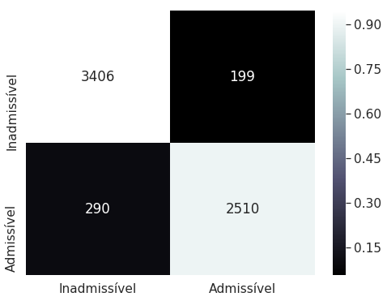

# Hackathon-Sebrae

This was a 2-day solution for a Machine Learning/Deep Learning Hackathon. 
We aimed to check the admissibility of a case having the right of appealing to be judged by a higher juridical instance.

## Results

## Confusion Matrix

